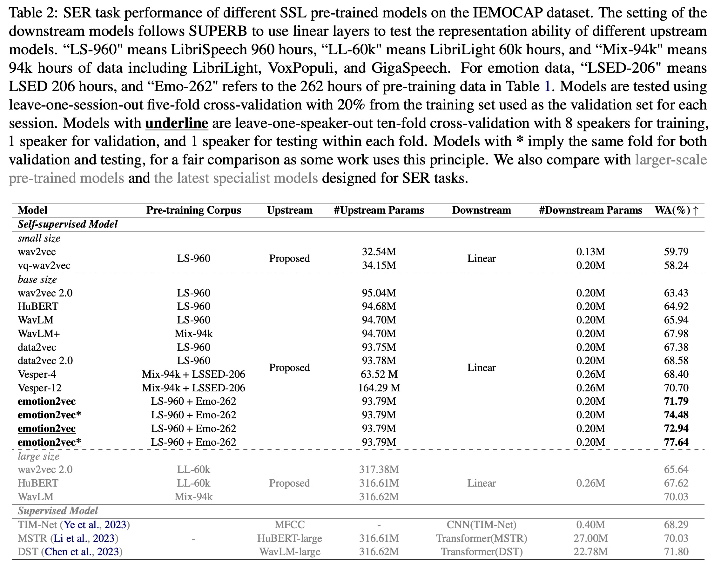
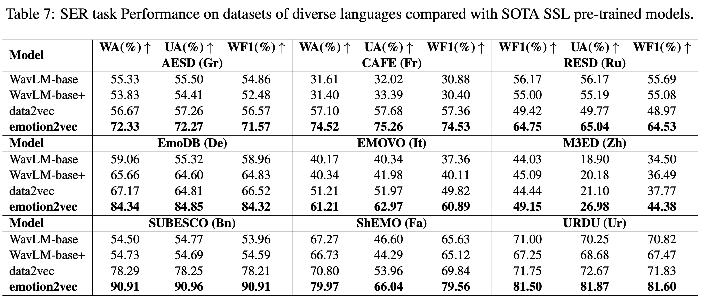

<div align="center">
    <h1>
    EMOTION2VEC
    </h1>
    <p>
    Official PyTorch code for extracting features and training downstream models with <br>
    <b><em>emotion2vec: Self-Supervised Pre-Training for Speech Emotion Representation</em></b>
    </p>
    <p>
    
    </p>
    <p>
    (Logo generated by DALL·E 3)
    </p>
    <a href="https://github.com/ddlBoJack/MT4SSL"></a>
    <a href="https://github.com/ddlBoJack/MT4SSL"></a>
    <a href="https://github.com/ddlBoJack/MT4SSL"></a>
    <a href="https://github.com/ddlBoJack/MT4SSL"></a>
</div>

## Guides

emotion2vec is the first universal speech emotion representation model. Through self-supervised pre-training, emotion2vec has the ability to extract emotion representation across different tasks, languages, and scenarios.


## Model
The paper is coming soon.

## Performance
### Performance on IEMOCAP
emotion2vec achieves SOTA with only linear layers on the mainstream IEMOCAP dataset. 


### Performance on other languages
emotion2vec achieves SOTA compared with SOTA SSL models on multiple languages (Mandarin, French, German, Italian, etc.). Refer to the paper for more details.


### Performance on other speech emotion tasks
Refer to the paper for more details.


## Extract features
### Download extracted features
We provide the extracted features of popular emotion dataset IEMOCAP. The features are extracted from the last layer of emotion2vec. The features are stored in `.npy` format and the sample rate of the extracted features is 50Hz. The utterance-level features are computed by averaging the frame-level features.
- frame-level: [Google Drive](https://drive.google.com/file/d/1JdQzwDJJEdKZcqSC1TXETvFZ7VpUvLEX/view?usp=sharing) | [Baidu Netdisk](https://pan.baidu.com/s/1FtCwhUwhONaeEos4nLYFWw?pwd=zb3p) (password: zb3p)
- utterance-level: [Google Drive](https://drive.google.com/file/d/1jJVfoEKC8yjwj39F__8jIQayd5PBO0WD/view?usp=sharing) | [Baidu Netdisk](https://pan.baidu.com/s/1AsJHacD6a5h27YJiCSee4w?pwd=qu3u) (password: qu3u)

All wav files are extracted from the original dataset for diverse downstream tasks. If want to train with standard 5531 utterances for 4 emotions classification, please refer to `iemocap_downstream`.

### Extract features from your dataset
The minimum environment requirements are `python>=3.8` and `torch>=1.13`. Our testing environments are `python=3.8` and `torch=2.01`.
1. git clone repos.
```bash
pip install fairseq
git clone https://github.com/ddlBoJack/emotion2vec.git
```

2. download emotion2vec checkpoint from:
- [Google Drive](https://drive.google.com/file/d/10L4CEoEyt6mQrqdblDgDSfZETYvA9c2T/view?usp=sharing)
- [Baidu Netdisk](https://pan.baidu.com/s/15zqmNTYa0mkEwlIom7DO3g?pwd=b9fq) (password: b9fq).

3. modify and run `scripts/extract_features.sh`

## Training your downstream model
We provide training scripts for IEMOCAP dataset in `iemocap_downstream`. You can modify the scripts to train your downstream model on other datasets.
