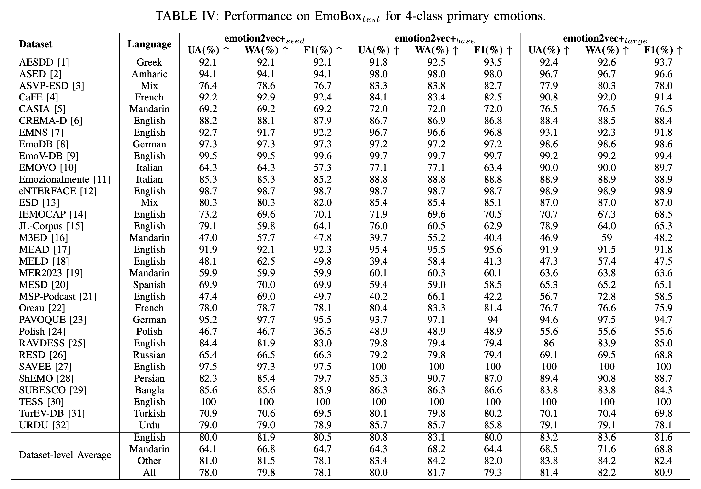

<div align="center">
    <h1>
    EMOTION2VEC
    </h1>
    <p>
    Official PyTorch code for extracting features and training downstream models with <br>
    <b><em>emotion2vec: Self-Supervised Pre-Training for Speech Emotion Representation</em></b>
    </p>
    <p>
    
    </p>
    <p>
    </p>
    <a href="https://github.com/ddlBoJack/emotion2vec"></a>
    <a href="https://github.com/ddlBoJack/emotion2vec"></a>
    <a href="https://github.com/ddlBoJack/emotion2vec"></a>
    <a href="https://github.com/ddlBoJack/emotion2vec"></a>
</div>

# News

- [Jun. 2024] 🔧 We fix a bug in emotion2vec+. Please re-pull the latest code. 
- [May. 2024] 🔥 Speech emotion recognition foundation model: **emotion2vec+**, with 9-class emotions has been released on [Model Scope](https://modelscope.cn/models/iic/emotion2vec_plus_large/summary) and [Hugging Face](https://huggingface.co/emotion2vec). Check out a series of emotion2vec+ (seed, base, large) models for SER with high performance **(We recommend this release instead of the Jan. 2024 release)**. 
- [Jan. 2024] 9-class emotion recognition model with iterative fine-tuning from emotion2vec has been released in [modelscope](https://www.modelscope.cn/models/iic/emotion2vec_base_finetuned/summary) and [FunASR](https://github.com/alibaba-damo-academy/FunASR/tree/main/examples/industrial_data_pretraining/emotion2vec). 
- [Jan. 2024] **emotion2vec** has been integrated into [modelscope](https://www.modelscope.cn/models/iic/emotion2vec_base/summary) and [FunASR](https://github.com/alibaba-damo-academy/FunASR/tree/main/examples/industrial_data_pretraining/emotion2vec).  
- [Dec. 2023] We release the [paper](https://arxiv.org/abs/2312.15185), and create a [WeChat group](./src/Wechat.jpg) for emotion2vec. 
- [Nov. 2023] We release code, checkpoints, and extracted features for emotion2vec. 

# Model Card
GitHub Repo: [emotion2vec](https://github.com/ddlBoJack/emotion2vec)
|Model|⭐Model Scope|🤗Hugging Face|Fine-tuning Data (Hours)|
|:---:|:-------------:|:-----------:|:-------------:|
|emotion2vec|[Link](https://www.modelscope.cn/models/iic/emotion2vec_base/summary)|[Link](https://huggingface.co/emotion2vec/emotion2vec_base)|/|
|emotion2vec+ seed|[Link](https://modelscope.cn/models/iic/emotion2vec_plus_seed/summary)|[Link](https://huggingface.co/emotion2vec/emotion2vec_plus_seed)|201|
|emotion2vec+ base|[Link](https://modelscope.cn/models/iic/emotion2vec_plus_base/summary)|[Link](https://huggingface.co/emotion2vec/emotion2vec_plus_base)|4788|
|emotion2vec+ large|[Link](https://modelscope.cn/models/iic/emotion2vec_plus_large/summary)|[Link](https://huggingface.co/emotion2vec/emotion2vec_plus_large)|42526|

# Overview

- [emotion2vec+: speech emotion recognition foundation model](#emotion2vec-speech-emotion-recognition-foundation-model)
  - [Guides](#guides)
  - [Data Engineering](#data-engineering)
  - [Performance](#performance)
  - [Inference with checkpoints](#inference-with-checkpoints)
    - [Install from modelscope (Recommended)](#install-from-modelscope-recommended)
    - [Install from FunASR](#install-from-funasr)
- [emotion2vec: universal speech emotion representation model](#emotion2vec-universal-speech-emotion-representation-model)
  - [Guides](#guides-1)
  - [Performance](#performance-1)
    - [Performance on IEMOCAP](#performance-on-iemocap)
    - [Performance on other languages](#performance-on-other-languages)
    - [Performance on other speech emotion tasks](#performance-on-other-speech-emotion-tasks)
  - [Visualization](#visualization)
  - [Extract features](#extract-features)
    - [Download extracted features](#download-extracted-features)
    - [Extract features from your dataset](#extract-features-from-your-dataset)
      - [Install from the source code](#install-from-the-source-code)
      - [Install from modelscope (Recommended)](#install-from-modelscope-recommended-1)
      - [Install from FunASR](#install-from-funasr-1)
  - [Training your downstream model](#training-your-downstream-model)
  - [Citation](#citation)

# emotion2vec+: speech emotion recognition foundation model

## Guides
emotion2vec+ is a series of foundational models for speech emotion recognition (SER). We aim to train a "whisper" in the field of speech emotion recognition, overcoming the effects of language and recording environments through data-driven methods to achieve universal, robust emotion recognition capabilities. The performance of emotion2vec+ significantly exceeds other highly downloaded open-source models on Hugging Face.


## Data Engineering
We offer 3 versions of emotion2vec+, each derived from the data of its predecessor. If you need a model focusing on spech emotion representation, refer to [emotion2vec: universal speech emotion representation model](#emotion2vec-universal-speech-emotion-representation-model).

- emotion2vec+ seed: Fine-tuned with academic speech emotion data from [EmoBox](https://github.com/emo-box/EmoBox)
- emotion2vec+ base: Fine-tuned with filtered large-scale pseudo-labeled data to obtain the base size model (~90M)
- emotion2vec+ large: Fine-tuned with filtered large-scale pseudo-labeled data to obtain the large size model (~300M)

The iteration process is illustrated below, culminating in the training of the emotion2vec+ large model with 40k out of 160k hours of speech emotion data. Details of data engineering will be announced later. 

## Performance

Performance on [EmoBox](https://github.com/emo-box/EmoBox) for 4-class primary emotions (without fine-tuning). Details of model performance will be announced later. 



## Inference with checkpoints

### Install from modelscope (Recommended)

1. install modelscope and funasr
```bash
pip install -U funasr modelscope
```

2. run the code.
```python
'''
Using the finetuned emotion recognization model

rec_result contains {'feats', 'labels', 'scores'}
	extract_embedding=False: 9-class emotions with scores
	extract_embedding=True: 9-class emotions with scores, along with features

9-class emotions: 
iic/emotion2vec_plus_seed, iic/emotion2vec_plus_base, iic/emotion2vec_plus_large (May. 2024 release)
iic/emotion2vec_base_finetuned (Jan. 2024 release)
    0: angry
    1: disgusted
    2: fearful
    3: happy
    4: neutral
    5: other
    6: sad
    7: surprised
    8: unknown
'''

from modelscope.pipelines import pipeline
from modelscope.utils.constant import Tasks

inference_pipeline = pipeline(
    task=Tasks.emotion_recognition,
    model="iic/emotion2vec_plus_large", # Alternative: iic/emotion2vec_plus_seed, iic/emotion2vec_plus_base, iic/emotion2vec_plus_large and iic/emotion2vec_base_finetuned
    model_revision="master")

rec_result = inference_pipeline('https://isv-data.oss-cn-hangzhou.aliyuncs.com/ics/MaaS/ASR/test_audio/asr_example_zh.wav', output_dir="./outputs", granularity="utterance", extract_embedding=False)
print(rec_result)
```
The model will be downloaded automatically.


### Install from FunASR
1. install funasr
```bash
pip install -U funasr
```

2. run the code.
```python
'''
Using the finetuned emotion recognization model

rec_result contains {'feats', 'labels', 'scores'}
	extract_embedding=False: 9-class emotions with scores
	extract_embedding=True: 9-class emotions with scores, along with features

9-class emotions: 
iic/emotion2vec_plus_seed, iic/emotion2vec_plus_base, iic/emotion2vec_plus_large (May. 2024 release)
iic/emotion2vec_base_finetuned (Jan. 2024 release)
    0: angry
    1: disgusted
    2: fearful
    3: happy
    4: neutral
    5: other
    6: sad
    7: surprised
    8: unknown
'''

from funasr import AutoModel

model = AutoModel(model="iic/emotion2vec_base_finetuned") # Alternative: iic/emotion2vec_plus_seed, iic/emotion2vec_plus_base, iic/emotion2vec_plus_large and iic/emotion2vec_base_finetuned

wav_file = f"{model.model_path}/example/test.wav"
rec_result = model.generate(wav_file, output_dir="./outputs", granularity="utterance", extract_embedding=False)
print(rec_result)
```
The model will be downloaded automatically.

FunASR support file list input in wav.scp (kaldi style):
```
wav_name1 wav_path1.wav
wav_name2 wav_path2.wav
...
```
Refer to [FunASR](https://github.com/alibaba-damo-academy/FunASR/tree/main/examples/industrial_data_pretraining/emotion2vec) for more details.


# emotion2vec: universal speech emotion representation model

## Guides

emotion2vec is the first universal speech emotion representation model. Through self-supervised pre-training, emotion2vec has the ability to extract emotion representation across different tasks, languages, and scenarios.

## Performance
### Performance on IEMOCAP
emotion2vec achieves SOTA with only linear layers on the mainstream IEMOCAP dataset. Refer to the paper for more details.


### Performance on other languages
emotion2vec achieves SOTA compared with SOTA SSL models on multiple languages (Mandarin, French, German, Italian, etc.). Refer to the paper for more details.


### Performance on other speech emotion tasks
Refer to the paper for more details.

## Visualization
UMAP visualizations of learned features on the IEMOCAP dataset. <span style="color:red;">Red</span> and <span style="color:blue;">Blue</span> tones mean low and high arousal emotional classes, respectively.  Refer to the paper for more details. 


## Extract features
### Download extracted features
We provide the extracted features of popular emotion dataset IEMOCAP. The features are extracted from the last layer of emotion2vec. The features are stored in `.npy` format and the sample rate of the extracted features is 50Hz. The utterance-level features are computed by averaging the frame-level features.
- frame-level: [Google Drive](https://drive.google.com/file/d/1JdQzwDJJEdKZcqSC1TXETvFZ7VpUvLEX/view?usp=sharing) | [Baidu Netdisk](https://pan.baidu.com/s/1FtCwhUwhONaeEos4nLYFWw?pwd=zb3p) (password: zb3p)
- utterance-level: [Google Drive](https://drive.google.com/file/d/1jJVfoEKC8yjwj39F__8jIQayd5PBO0WD/view?usp=sharing) | [Baidu Netdisk](https://pan.baidu.com/s/1AsJHacD6a5h27YJiCSee4w?pwd=qu3u) (password: qu3u)

All wav files are extracted from the original dataset for diverse downstream tasks. If want to train with standard 5531 utterances for 4 emotions classification, please refer to the `iemocap_downstream` folder.

### Extract features from your dataset
#### Install from the source code
The minimum environment requirements are `python>=3.8` and `torch>=1.13`. Our testing environments are `python=3.8` and `torch=2.01`.
1. git clone repos.
```bash
pip install fairseq
git clone https://github.com/ddlBoJack/emotion2vec.git
```

2. download emotion2vec checkpoint from:
- [Google Drive](https://drive.google.com/file/d/10L4CEoEyt6mQrqdblDgDSfZETYvA9c2T/view?usp=sharing)
- [Baidu Netdisk](https://pan.baidu.com/s/15zqmNTYa0mkEwlIom7DO3g?pwd=b9fq) (password: b9fq)
- [modelscope](https://www.modelscope.cn/models/damo/emotion2vec_base/summary): `git clone https://www.modelscope.cn/damo/emotion2vec_base.git`

3. modify and run `scripts/extract_features.sh`

#### Install from modelscope (Recommended)

1. install modelscope and funasr
```bash
pip install -U funasr modelscope
```

2. run the code.
```python
'''
Using the emotion representation model
rec_result only contains {'feats'}
	granularity="utterance": {'feats': [*768]}
	granularity="frame": {feats: [T*768]}
'''

from modelscope.pipelines import pipeline
from modelscope.utils.constant import Tasks

inference_pipeline = pipeline(
    task=Tasks.emotion_recognition,
    model="iic/emotion2vec_base")

rec_result = inference_pipeline('https://isv-data.oss-cn-hangzhou.aliyuncs.com/ics/MaaS/ASR/test_audio/asr_example_zh.wav', output_dir="./outputs", granularity="utterance")
print(rec_result)
```
The model will be downloaded automatically.

Refer to model scope of [emotion2vec_base](https://www.modelscope.cn/models/damo/emotion2vec_base/summary) and [emotion2vec_base_finetuned](https://www.modelscope.cn/models/iic/emotion2vec_base_finetuned/summary) for more details.


#### Install from FunASR
1. install funasr
```bash
pip install -U funasr
```

2. run the code.
```python
'''
Using the emotion representation model
rec_result only contains {'feats'}
	granularity="utterance": {'feats': [*768]}
	granularity="frame": {feats: [T*768]}
'''

from funasr import AutoModel

model = AutoModel(model="iic/emotion2vec_base")

wav_file = f"{model.model_path}/example/test.wav"
rec_result = model.generate(wav_file, output_dir="./outputs", granularity="utterance")
print(rec_result)
```
The model will be downloaded automatically.

FunASR support file list input in wav.scp (kaldi style):
```
wav_name1 wav_path1.wav
wav_name2 wav_path2.wav
...
```
Refer to [FunASR](https://github.com/alibaba-damo-academy/FunASR/tree/main/examples/industrial_data_pretraining/emotion2vec) for more details.

## Training your downstream model
We provide training scripts for IEMOCAP dataset in the `iemocap_downstream` folder. You can modify the scripts to train your downstream model on other datasets.

## Citation
If you find our emotion2vec code and paper useful, please kindly cite:
```
@article{ma2023emotion2vec,
  title={emotion2vec: Self-Supervised Pre-Training for Speech Emotion Representation},
  author={Ma, Ziyang and Zheng, Zhisheng and Ye, Jiaxin and Li, Jinchao and Gao, Zhifu and Zhang, Shiliang and Chen, Xie},
  journal={arXiv preprint arXiv:2312.15185},
  year={2023}
}
```
